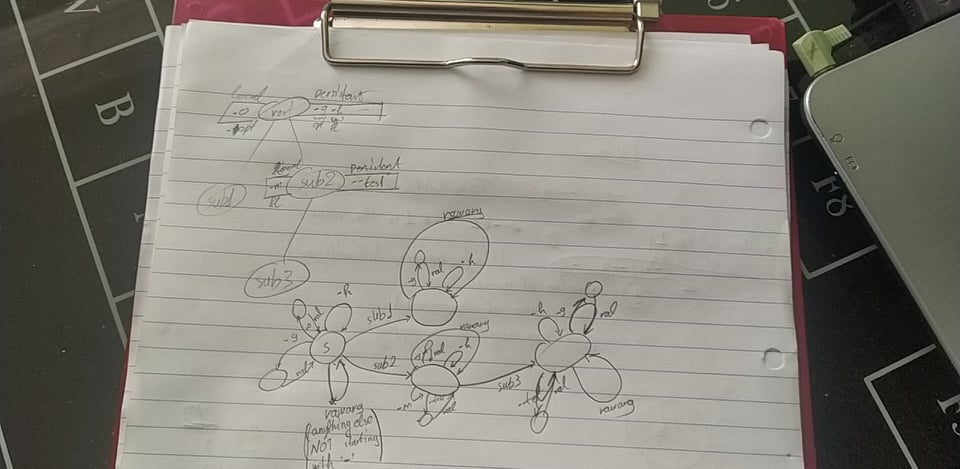

## Notes <!-- omit in toc -->

- [**Functionality**:](#functionality)
- [**Implementation details**:](#implementation-details)
  - [**Tokens**](#tokens)
  - [**Issues**](#issues)
- [**Notes**](#notes)

### **Functionality**:
- subcommands
- local/global flags/options
    - flags (boolean, toggle)
    - options (non-boolean, set)
- arguments passed to command actions (anything that is not a flag name, an option name, an option value or a subcommand)

### **Implementation details**:
#### **Tokens**
**x: any string of length 1**,  
**y: any string of any length (>=0)**
- -x, --y, -y (long/short form options and flags. e.g. -l, --long, -l1000)
- y
  - value of option (e.g. -l 1000)
  - name of subcommand (e.g. node, subnode, bootstrap, or any other non-flag/option name)
  - value of raw argument to pass to command action  
  
Real tokens do not provide enough detail to be used as events for the fsm.  
Therefore, we need some-way to split them into more categories
| token-form | description                                                | token-name |
| ---------- | ---------------------------------------------------------- | ---------- |
| -x         | short flag/option                                          | sfl / sopt |
| -y -> -x y | short option and value (!not flag since a value is given!) | sfl val    |
| --y        | long flag/option                                           | lfl / lopt |
| y          | option value                                               | val        |
| y          | subcommand name                                            | cmdname    |
| y          | raw argument to pass                                       | rawarg     |

remaining issues:
- decide between (s/l)fl and (s/l)opt (doable by keeping track of visible flags/options and seeing which one they are)
- decide between val cmdname rawarg
  - if at state after (s/l)opt and y is not a visible cmdname, then it's a val
  - if at state after (s/l)opt and y is a visible cmdname, then error 'conflict'
  - if at any other state and y is a visible cmdname, then cmdname
  - else rawarg

- decisions
  - flags/options not consumed will produce an error
#### **Issues**
Need to find a way to avoid the issue of having the amount of subcommands/flags/options in the type cause that way we cannot store them in an array. Possible resolution for this could be preallocating the max amount for each... for example if one command has 10 subcommands, then all commands would have space for **at least** 10 subcommands. 

### **Notes**
- each flag name can only exist once. (this allows for flags/options to be grabbed from any place in the arguments).

- one state for each (sub)command
- each option of a (sub)command needs another state
- each persistent option produces another state in all subcommands
- each flag is a transition from self to self
- each persistent flag is a transition from self to self in all subcommands
- each (sub)command has a transition from self to self for rawargs (raw args being anything that's not a subcommand and doesn't start with '-')
